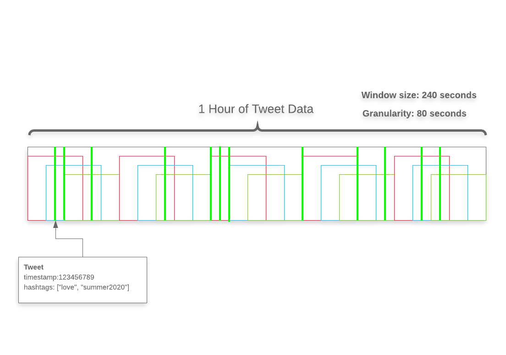

# PyZTrending

PyZTrending is a library for determining "trending" data in a dataset using **z scores** - think #trending on Twitter, 
but for any use case. 

### Overview

#### Data structures

The PyZTrending package assumes an architecture that involves **two types of entities** - `Document` and `Token`.
As a familiar use case, I'll use tweets and hashtags in Twitter to demonstrate the system. 
In the case of Twtitter, imagine a Python class called `Tweet`:
```python
from typing import List
from datetime import datetime

class Tweet:

    def __init__(self, tweet_text: str, timestamp: datetime):
        self.tweet_text = tweet_text
        self.timestamp = timestamp
        self.hashtags: List[str] = self.extract_hashtags()
```
In this use case, a `Tweet` is the `Document` and a hashtag would be the `Token` (a single document can contain
multiple tokens). The idea is that a document is a single instance of a piece of data that contains trending data, 
just like the `Tweet` class contains `hashtags`. Crucial to the working of the system is that documents, and therefore 
tokens, have a real timestamp associated with them. This is critical as PyZTrending uses real times for determining 
trending data and does not work well with other system of time (such as 0-100 or something similar).

PyZTrending works in two parts. The first part is the **historical data ingestion**, which consumes multiple documents 
that are used as a "training" dataset (not to be confused with training in Machine Learning, this does not use 
Machine Learning). This part of the system will determine the what tokens have a lot of exposure and what tokens
are seldom seen. 

If we image Twitter again, we can imagine that "#Trump" gets mentioned often, but perhaps #Trump was only trending
during the first few months after Trump announced his bid for presidency - after a while, #Trump became so commonplace
that it could no longer be considered trending (https://www.americanscientist.org/article/the-britney-spears-problem). 
Getting trending data by z scores helps us focus on tokens (hashtags) that are currently being disproportionately 
mentioned.

After historical data is provided, PyZTrending can look at new data and determine what's trending.

#### Windows

PyZTrending analyzes historical data on a rolling window basis, which accepts two parameters: a window size, and a step 
size, as demonstrated in the following diagram:



### Usage

First, PyZTrending expects there to be a Class that represents some sort of document. The `Tweet` class from before will
be used as demonstration. PyZTrending is BYOC (Bring Your Own Class). In order to accomplish this, PyZ needs an 
interpreter in order to understand the class.

```python
from typing import List
from datetime import datetime

from pyztrending import Trending

class Tweet:

    def __init__(self, tweet_text: str, timestamp: datetime):
        self.tweet_text = tweet_text
        self.timestamp = timestamp
        self.hashtags: List[str] = self.extract_hashtags()

def interpret_tweet(tweet: Tweet):
    return tweet.hashtags, tweet.timestamp

def hashtag_weight_scale(tweet: Tweet, hashtag: str):
    return 1

trending = Trending(30, 10)

trending.add_interpreter(Tweet, interpret_tweet, hashtag_weight_scale)
```

Focus on just the `add_interpreter` function and the `interpret_tweet` argument/function for now. 
This function tells `PyZTrending` how to get the two pieces of data in needs from our data structure - the tokens
and a `datetime` timestamp. Every `Tweet` instance and every document that is provided to be supported via an
interpreter that will return a tuple `Tuple[List, datetime]`. Keep in mind that even though `tweet.hashtags` is a list,
each hashtag is treated separately.