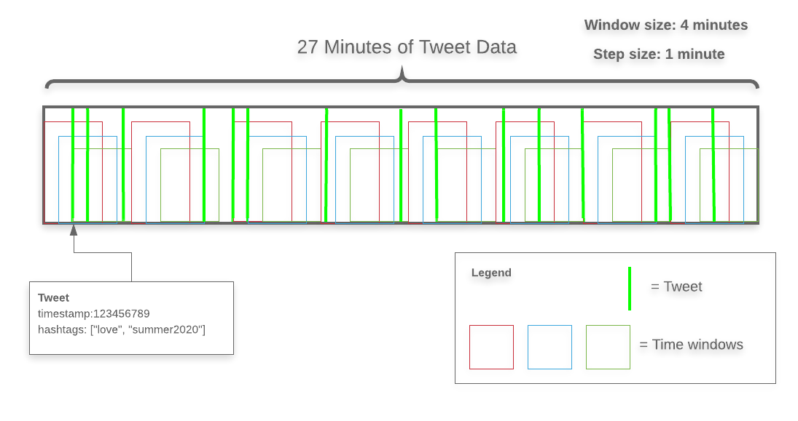

# PyZTrending

PyZTrending is a library for determining "trending" data in a dataset using **z scores** - think #trending on Twitter, 
but for any use case. 

### Overview

#### Data structures

The PyZTrending architecture involves **two types of entities** - `Document` and `Token`. As a familiar use case, 
I'll use tweets and hashtags in Twitter to demonstrate the system. In the case of Twtitter, imagine a Python class 
called `Tweet`:
```python
from typing import List
from datetime import datetime

class Tweet:

    def __init__(self, tweet_text: str, timestamp: datetime, author: TwitterUser):
        self.author = author
        self.tweet_text = tweet_text
        self.timestamp = timestamp
        self.hashtags: List[str] = self.extract_hashtags()
```
In this use case, a `Tweet` is the `Document` and a single hashtag would be the `Token` (a single document can contain
multiple tokens). The idea is that a document is a single instance of a piece of data that contains trending data, 
just like the `Tweet` class contains `hashtags`. Crucial to the working of the system is that documents, and therefore 
tokens, have a real timestamp associated with them. This is critical as PyZTrending uses real times for determining 
trending data and does not work well with other systems of time (such as 0-100).

PyZTrending works in two parts. The first part is the **historical data ingestion**, which consumes multiple documents 
that are used as a "training" dataset (not to be confused with training in Machine Learning; this does not use 
Machine Learning). This part of the system will determine which tokens have a lot of exposure and which tokens
are seldom seen. 

If we imagine Twitter again, the "#Trump" hashtag gets mentioned often, but perhaps "#Trump" was only trending
during the first few months after Donald Trump announced his bid for presidency - after a while, "#Trump" became so
commonplace that it could no longer be considered trending 
(https://www.americanscientist.org/article/the-britney-spears-problem). Getting trending data by z scores helps us 
focus on tokens (hashtags) that are currently being disproportionately mentioned.

After historical data is provided, PyZTrending can look at new data and determine what's trending.

#### Windows

PyZTrending analyzes historical data on a rolling window basis, which accepts two parameters: a window size, and a step 
size, as demonstrated in the following diagram:



The diagram aboe is an example of one hour's worth of Tweet data. In total, there are 24 windows. Each window
is 4 minutes long, and just as importantly the window step size is 1 minute. PyZTrending analyzes each window of time,
from the earliest document to the last, and calculates a score that is a function of each token (e.g. hashtag) 
that is mentioned in that window. The first tweet in the diagram for example, which contains the hashtags "love" and 
"summer2020" is a part of the window that starts at some T=0 and ends at T=240 seconds. If the scores for tokens were
calculated simply by the number of times the token appeared in a window, then the score for `love` in T(0,240) would be
`1` and the score for `summer2020` in T(0,240) would be `1`.

There is also a second tweet that falls into the first window. If that tweet also happened to have the tweet "love" but
not "summer2020" then T(0,240) for "love" would be `2` while T(0,240) for "summer2020" would remain `1`. Also notice 
that both the first and second tweets fall into more than just 1`window. More specifically, the first tweet falls in two
windows: T(0,240) and T(60,300). Meanwhile, the second tweet falls into three windows: T(0,240), T(60,300), and
T(120,360).

The reason for having a step size parameter, and not just starting a new window where the last one left off, is that
it allows PyZTrending that have a more granular view of the data that shows how gradually over time tokens can shift
from trending to not. This is especially useful for datasets that aren't as densely concentrated as Twitter's, for
example. If it is not desirable to have multiple windows overlap, it is possible to set the step size equal to the
window size, which will make all windows be adjacent.

Once historical data ingestion is complete, PyZTrending has a distribution available that can help it calculate z scores
for new incoming data, which it compares to previous time windows. 

#### Weight Scales

When determining a trending hashtag based off of a collection of tweets, one option is calculate simply the number
of times a hashtag appeared in a certain time window. In this case, we use a weighting function that simply adds
to a counter, which contains the total number of times a hashtag was mentioned in a time window. In order to do that,
we can use the following weighting function:

```python
def hashtag_weight_scale(tweet: Tweet, hashtag: str):
    return 1
``` 

However, there could also be a scenario where not all hashtags should contribute the same towards a trending algorithm.
One such example could be if the user who wrote the tweet was taken into account - and by extension, their number of 
followers:

```python
from typing import List
from datetime import datetime

from pyztrending import Trending

class Tweet:

    def __init__(self, tweet_text: str, timestamp: datetime):
        self.tweet_text = tweet_text
        self.timestamp = timestamp
        self.hashtags: List[str] = self.extract_hashtags()

def hashtag_weight_scale(tweet: Tweet, hashtag: str):
    lots_of_followers: int = 1000000
    if tweet.author.num_followers > lots_of_followers:
        return 10
    return 1

trending = Trending(240, 60)

trending.add_class_support(Tweet, ..., hashtag_weight_scale)
```

In this scenario, the weighting function for determining how much is contributed towards a trending scale is dependent
on the number of followers that the author of the tweet has.

Weight scales take two arguments:
  1. the document that is being looked at
  2. **one** of tokens that is found in that document

#### Interpreting Data Structures

First, PyZTrending expects there to be a Class that represents some sort of document. The `Tweet` class from before will
be used as demonstration. PyZTrending is BYOC (Bring Your Own Class). In order to accomplish this, PyZ needs an 
interpreter in order to understand the class.

```python
from typing import List
from datetime import datetime

from pyztrending import Trending

class Tweet:

    def __init__(self, tweet_text: str, timestamp: datetime):
        self.tweet_text = tweet_text
        self.timestamp = timestamp
        self.hashtags: List[str] = self.extract_hashtags()

def interpret_tweet(tweet: Tweet):
    return tweet.hashtags, tweet.timestamp

trending = Trending(240, 60)

trending.add_class_support(Tweet, interpret_tweet, ...)
```

The `add_interpreter` function tells `PyZTrending` how to get the two pieces of data in needs from our data structure 
- the tokens and a `datetime` timestamp. Every `Tweet` instance and every document that is provided to be supported via 
an interpreter that will return a tuple `Tuple[List, datetime]`. Keep in mind that even though `tweet.hashtags` is a 
list, each hashtag is treated separately.

We could also use PyZTrending to interpret dictionaries/JSON data structures, given a way to identify and differentiate
between them. The below example demonstrates this, along with demonstrating how one might deal with various types of 
JSON structures:

```python
from typing import Dict
from datetime import datetime
from pyztrending import Trending

def interpret_json_tweet(tweet: Dict):
    if 'type' in tweet:
        if tweet['type'] == 'tweet_type1':
            return tweet['hashtags'], datetime.fromtimestamp(tweet['timestamp'])
        elif tweet['type'] == 'tweet_type2':
            return tweet['hashtag_array'], datetime.fromtimestamp(tweet['timestamp'])
    raise TypeError(f"Unknown data structure for object {tweet}")

trending = Trending(240, 60)

trending.add_class_support(Dict, interpret_json_tweet, ...)
```